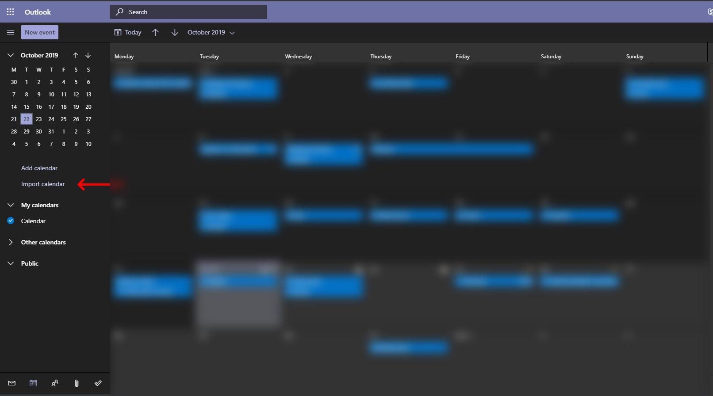
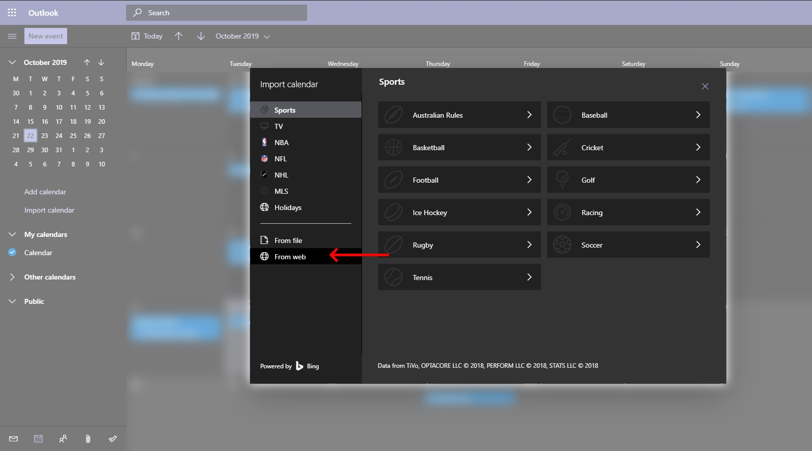
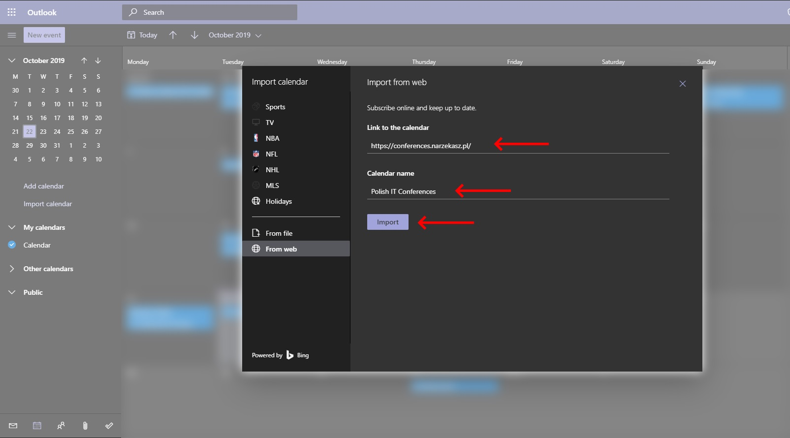

## Subskrypcja kalendarza "Polish IT Conferences"
Link do pliku kalendarza `ical`: https://conferences.narzekasz.pl/

Aby zaimportować kalendarz postępuj według instrukcji odpowiednich dla twojej platformy.

### MacOS
https://www.howtogeek.com/409359/how-to-subscribe-to-calendars-on-mac/

### Google calendar
https://www.howtogeek.com/howto/30834/add-an-ical-or-.ics-calendar-to-google-calendar/

### Outlook calendar
https://www.howtogeek.com/408364/how-to-show-a-google-calendar-in-outlook/

### Outlook calendar online

**Krok 1:**

**Krok 2:**

**Krok 3:**

